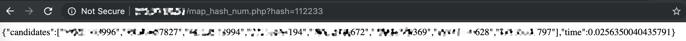

# Pre-calculated phone numbers hash map

This tool allows to pre-compute a list of hashes for a range of telephone numbers. It can use either postgresql + web service or sqlite3.

## Installation

**Tested on: Ubuntu 18.04**

Install dependencies

```
sudo apt update
sudo apt install postgresql apache2 apache2-utils php php-pgsql libapache2-mod-php libpq5 postgresql postgresql-client postgresql-client-common postgresql-contrib python python-pip python-pip postgresql-server-dev-all
sudo pip install psycopg2
```

Prepare database

- Postgresql

```
sudo -u postgres psql < db_init.sql
```

Place lookup script into webserver directory:

```
cp map_hash_num.php /var/www/html/
```

- SQLite

```
python3 hashmap_gen_sqlite.py dbinit
```

Fill database with hashes for phone numbers range with your favorite preffix (e.g. +12130000000 -> +12139999999)

- Postgresql

```
python3 hashmap_gen.py 1213
```

- SQLite

```
python3 hashmap_gen_sqlite.py 1213XXXXXX
```

## Usage

Now you can get mobile phones by 3 bytes of SHA256(phone_number) this way:

```
http://127.0.0.1/map_hash_num.php?hash=112233
```




will store the hashes for those numbers in a file named phones.db
